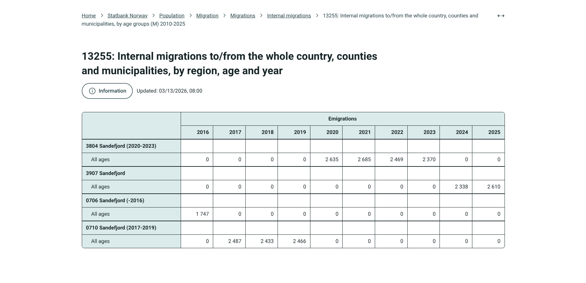
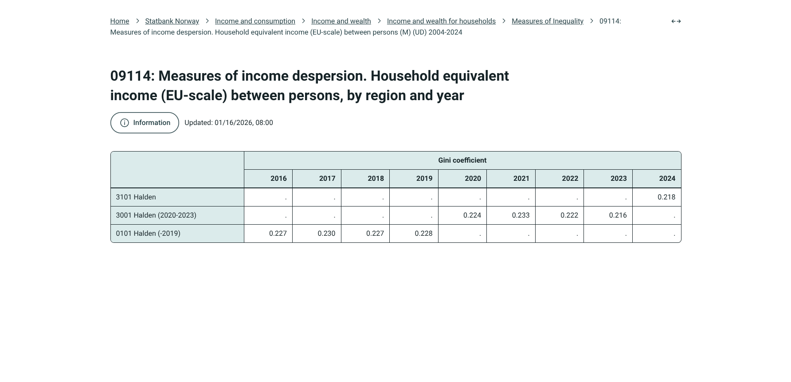
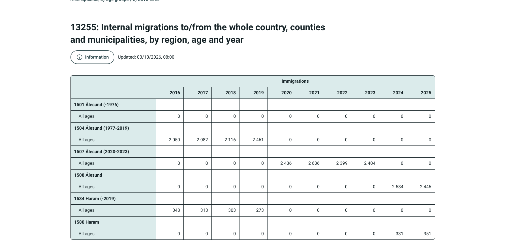

# munpatch

Norwegian municipalities change. They merge, they split, they are renamed,
and they get new municipal codes. A statistic collected under the old codes
has no value for the new ones, and vice versa, so a time series breaks in
the middle.

munpatch extrapolates Norwegian municipal statistics across these
administrative boundary changes (mergers, splits, recodes), so a time
series has a value for every municipality code in every year, even codes
that were renamed, merged, or split partway through the series.

This is what the breaks look like in Statistics Norway's own tables:



Sandefjord's municipality code changed three times (0706 → 0710 in 2017,
0710 → 3804 in 2020, 3804 → 3907 in 2024). In SSB table 13255 (internal
migrations) each code only has values while it was valid, so no single code
covers the whole decade.



The same pattern for a rate indicator: Halden's code changed twice (0101 →
3001 in 2020, 3001 → 3101 in 2024), and the Gini values in SSB table 09114
stop at each change.



Breaks aren't always a simple recode. Ålesund (1501 → 1504 → 1507) merged
with several neighboring codes -- including `1534` Haram -- into `1507` in
2020, then in 2024 `1507` split back into `1508` Ålesund and `1580` Haram --
so the same lineage has both a merge and a split in it, each needing its
own rule to bridge.

## How it works

Boundary changes are tracked in `data/changes.csv`, one row per code that
stopped being valid:

```
Code,Year,Recode,Split,Merge
0101,2019,3001,,
0104,2019,,,3002/0104;0136
```

- `Recode`: 1-to-1 rename.
- `Split`: semicolon-separated list of codes the row's code split into.
- `Merge`: `TARGET/SOURCE1;SOURCE2;...` — every source code gets its own row.
- `Year` is the last year the row's code was valid.

Given that plus a time series with gaps, `munpatch extrapolate` fills in
every missing (code, year) cell. Which rule applies depends on which side
of the boundary the missing cell is on (backward or forward in time from
where the code is actually valid) and which kind of change caused the gap.
These six cases are also the six reason types in `src/munpatch/changes.py`
(`RecodeFrom`/`MergeFrom`/`SplitFrom`/`RecodeTo`/`SplitTo`/`MergeTo`), and
`extrapolate()` in `src/munpatch/extrapolate.py` is just a dispatch over
them:

**Backward — filling in years before this code existed**, because it's the
*result* of a recode, merge, or split:

- **RecodeFrom**: copy the predecessor's value unchanged.
- **MergeFrom**: this code is the merge target. Sum the values of all the
  components that later merged into it.
- **SplitFrom**: this code is one of several children a single parent later
  split into. Take the parent's total for that year, times this code's
  share of the parent's total measured in the first year this code was
  valid (the split boundary) -- i.e. extrapolate backward from the split
  point assuming the same share held.

**Forward — filling in years after this code stopped existing**, because it
was *replaced* by a recode, merge, or split:

- **RecodeTo**: copy the successor's value unchanged.
- **SplitTo**: this code later split into several children. Sum the
  children's values back into the parent.
- **MergeTo**: this code later merged into a target, alongside other
  components. Take the merged unit's value for that year, times this
  code's share of the merged components' combined total measured in the
  year before the merger -- i.e. extrapolate forward from the merge point
  assuming the same share held.

Both `SplitFrom` and `MergeTo` make the same assumption: a code's
proportional share of its merge/split group, measured right at the
boundary year, is taken to hold for every year further from that boundary.
That's the extrapolation -- it's exact at the boundary and an approximation
the further out it's applied.

## Usage

```
uv sync

uv run munpatch fetch       --indicator all
uv run munpatch extrapolate --indicator all --changes data/changes.csv
# or both in one step:
uv run munpatch pipeline    --indicator all

# just one indicator instead of everything:
uv run munpatch fetch       --indicator gini
uv run munpatch extrapolate --indicator gini --changes data/changes.csv

# check whether changes.csv covers every code that disappears from an input file,
# without running the full extrapolation:
uv run munpatch check-changes --input data/raw/migration_in.csv --changes data/changes.csv
```

`--indicator` accepts `migration_in`, `migration_out`, `population`, `gini`,
or `all`. `population` isn't just another indicator to pick -- `gini` is a
rate/percentage indicator and depends on it being extrapolated first (see
"Absolute counts vs. rates/percentages" below); `--indicator all` handles
that ordering for you, but `--indicator gini` on its own requires
`population` to already be extrapolated (it is, out of the box -- see "Data
lives under" below).

Indicators are registered in `src/munpatch/indicators.py` -- currently
migration in/out, population, and the Gini coefficient -- with the
architecture built so more SSB tables can be added by registering a config
entry, not by writing new plumbing.

### Getting data on one municipal structure

`extrapolate` fills in every `(code, year)` cell, but the result still has a
row for *every* code that ever existed across the input's years -- old codes
that later merged, split, or got recoded away included, each carrying its
own extrapolated time series. That's not the same as "the current list of
municipalities": as of 2025 there are 357 valid codes, but a migration file
extrapolated back to 2011 has 842 distinct codes in it (the union of every
code across 2011-2025), so unfiltered output mixes both old and current
codes for every year.

`munpatch structure` is an optional step *on top of* the normal
fetch/extrapolate pipeline -- it doesn't refetch or re-extrapolate anything.
It reads the already-extrapolated file and narrows it down to one
consistent set of codes: the municipal structure valid in a given year,
each still carrying its full extrapolated series (the merge/split math that
produced those values already happened in `extrapolate`; this step is pure
selection over the result):

```
uv run munpatch extrapolate --indicator all --changes data/changes.csv
uv run munpatch structure    --indicator all --changes data/changes.csv --year 2026
```

`--year` defaults to the latest year present in the processed data (today,
that's 2025 -- `data/changes.csv` itself was generated from a masterlist
covering boundary changes through 2026, but the SSB data fetched so far
only reaches 2025).
Output goes to `<processed_path>_structure_<year>.csv` next to the regular
processed file, e.g. `data/processed/migration_in_structure_2026.csv`. As
more masterlist files get folded into `changes.csv` over time, later years
become selectable automatically -- no code changes needed.

Unlike the regular processed files (long format: `Year\tCode\tValue`), this
output is wide -- one row per code, one column per year -- with a `COD_MUN`
column added: the join key used by the Nordregio Nordic municipality
shapefiles' attribute table (field `COD_MUN`), e.g. code `0301` -> `NO0301`
("NO" + the zero-padded code). It's included here so the structure output
can be merged directly onto the map data:

```
Code    COD_MUN 2011    2012    ...     2025
0301    NO0301  28214.0 28698.0 ...     31533.0
1101    NO1101  442.0   346.0   ...     512.0
```

Data lives under `data/`: `changes.csv` (boundary changes),
`KOM_Masterliste_1838_2026.xlsx` (source for regenerating `changes.csv`, see
"Regenerating changes.csv from the masterlist" below), `raw/` (fetched
from SSB, `Code\tYear\tValue`), `processed/` (extrapolated, `Year\tCode\tValue`,
plus `*_structure_<year>.csv` files from `munpatch structure` -- wide format,
`Code\tCOD_MUN\t<year>...`, see "Getting data on one municipal structure" above).
`data/raw/*` and `data/processed/*` are otherwise gitignored (reproducible via
`fetch`/`extrapolate`) except `population.csv` in each, which is committed:
every rate/percentage indicator needs it extrapolated first (see below), so
having it pre-committed means that doesn't have to happen on every checkout.

## Absolute counts vs. rates/percentages

`extrapolate`'s merge/split rules (see "How it works" above) are only
valid for **absolute counts** -- people, events, anything where a whole is
truly the sum of its parts. Migration in/out fits: if two municipalities merge,
the merged municipality's in-migration is the sum of the two old ones'.

Those same rules give the wrong answer for a **rate, percentage, or other
ratio** (unemployment rate, Gini coefficient, income per capita, ...):

- **Merge**: you cannot sum two municipalities' rates to get the merged
  rate, and you cannot split a rate "proportionally by share" the way a
  count is split -- share of a rate isn't a meaningful quantity.
- The mathematically correct way to carry a rate across a boundary change is
  to convert it to an absolute count first (`rate * population` for that
  `(code, year)`), extrapolate *that* with the normal count rules, then
  convert back to a rate (`extrapolated_count / population` for the target
  `(code, year)`).

`extrapolate_ratio()` in `src/munpatch/extrapolate.py` implements this: it
does the rate -> count -> extrapolate -> count -> rate conversion described
above, raising `MissingPopulationError` if a
`(code, year)` it needs has no matching population figure.

`INDICATORS` (`src/munpatch/indicators.py`) has a `population` entry --
SSB table 06913 (`Folkemengde`, "Population 1 January"), already a total so
it needs no age/sex summing the way table 07459 would (see the table's own
`Kjonn`/`Alder` dimensions: no "all ages"/"both sexes" total code exists
there, unlike migration's `Alder=999A`; 06913 sidesteps that by not having
those dimensions at all). It's an absolute count like any other indicator,
so `fetch`/`extrapolate`/`structure` all work on it unchanged:

```
uv run munpatch fetch       --indicator population
uv run munpatch extrapolate --indicator population --changes data/changes.csv
```

A rate/percentage indicator registers like any other `IndicatorConfig`, plus
`weight_by="population"` (or the name of whatever count indicator should be
used as the weight). `gini` is a real, working example of this -- SSB table
09114 (`Ginikoeffisient`), no `Alder` dimension either:

```python
"gini": IndicatorConfig(
    table_id="09114",
    contents_code="Ginikoeffisient",
    raw_path="data/raw/gini.csv",
    processed_path="data/processed/gini.csv",
    age_code=None,
    weight_by="population",
),
```

`cmd_extrapolate` checks `weight_by`: `None` (the default) runs the normal
count path; set, it reads the weight indicator's **already-extrapolated**
processed file and runs `extrapolate_ratio()` instead. That means order
matters -- the weight indicator has to be extrapolated first
(`--indicator all` handles this automatically as long as the weight
indicator is registered before the indicators that use it, since `all`
processes `INDICATORS` in registration order; running a rate indicator on
its own before its weight is extrapolated raises a clear
`MissingPopulationError` telling you which indicator to extrapolate first,
rather than crashing on a missing file). `population` is committed to the
repo (see "Data lives under" above) specifically so this dependency is
already satisfied and `gini` -- or any future rate indicator -- can be
extrapolated right away:

```
uv run munpatch fetch       --indicator gini
uv run munpatch extrapolate --indicator gini --changes data/changes.csv
```

Spot-checked against known published figures: Oslo's Gini for 2018-2023 is
0.320, 0.314, 0.320, 0.365, 0.316, 0.307.

## Adding a new indicator

Add an entry to `INDICATORS` in `src/munpatch/indicators.py` with its SSB
table id, `ContentsCode`, and output paths. `fetch`, `extrapolate`, and the
CLI all work off that registry, so nothing else needs to change for an
absolute-count indicator. For a rate/percentage indicator, also set
`weight_by` (see above).

## Regenerating changes.csv from the masterlist

The masterlist itself comes from Statistics Norway's Klass API
(data.ssb.no/api/klass), classification 131, "Standard for
kommuneinndeling" -- SSB's official register for classifications and code
lists, which records every approved change to municipality codes and
names.

`data/changes.csv` can be regenerated from the official KOM Masterliste
instead of hand-curated:

```
uv run munpatch generate-changes \
  --masterlist data/KOM_Masterliste_1838_2026.xlsx \
  --min-year 2010 \
  --output data/changes.csv
```

This reads the `MASTERLISTE` sheet and mechanically translates
Kodeendring/Sammenslåing/Deling rows into Recode/Merge/Split rows. Most of
the masterlist translates cleanly, but a code that splits its territory
across *two or more* merge or split targets in the same year can't be
represented by the one-row-per-code format at all -- those are printed as
conflicts and left out of the output rather than guessed at, so they can be
resolved by hand after checking the masterlist.

## Known limitations

Two edge cases where the data or the algorithm don't fully cover reality --
a Gini-specific boundary-year mismatch for one merger, and three codes
whose territory split across multiple merge targets in the same year, which
the Recode/Split/Merge schema can't fully represent -- are documented in
`KNOWN_LIMITATIONS.md`.

## Tests

```
uv run pytest
```

Unit tests cover the extrapolation rules (recode/merge/split, both
directions, count and ratio mode) with synthetic data, the changes.csv
parsing and bidirectional transform, the masterlist-to-changes.csv
translation (including the conflict cases), the `IndicatorConfig` query
contract, and the CLI commands end-to-end (fetch/extrapolate/structure/
check-changes/generate-changes, with SSB calls mocked out). The
extrapolation output has also been checked cell-by-cell against a prior
known-good run for the overlapping 2019+ window: exact match, 0 mismatches
across 5,466 cells.
